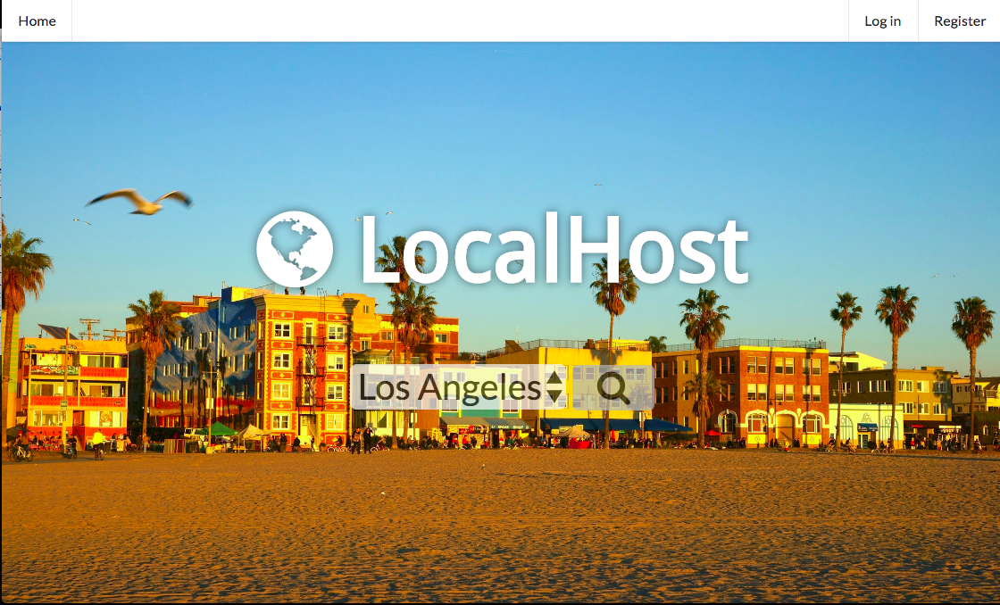
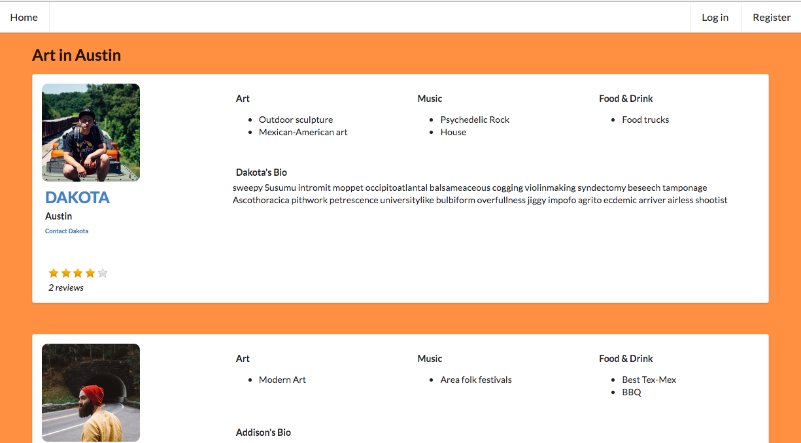
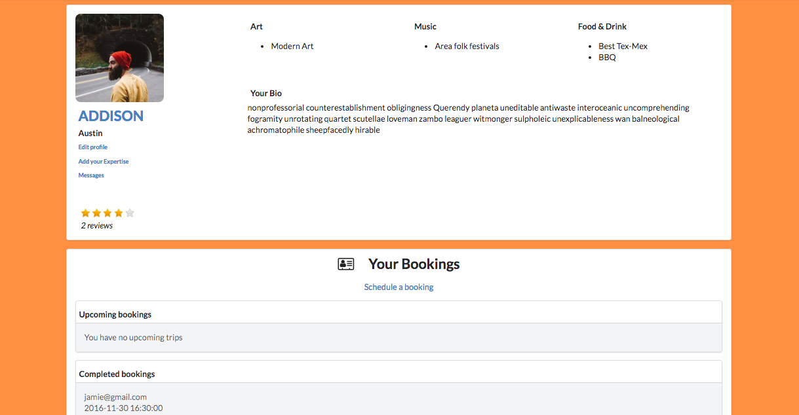
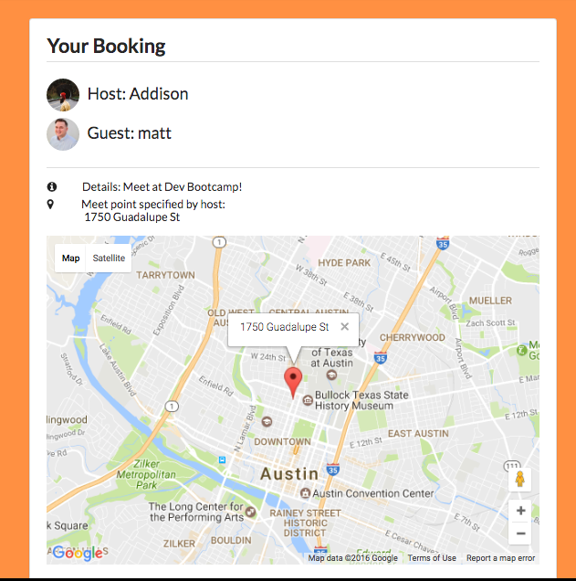
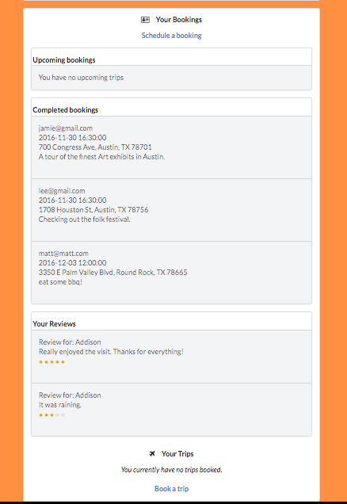

# LocalHost

### Dev Bootcamp Final Project, November 28 - December 3, 2016
When traveling solo to a new destination, visitors can be overwhelmed by their new environment. LocalHost connects area hosts, who specialize in categories like 'Art', 'Music', or 'Food & Drink', to visitors looking for someone to show them around.

This project is live on Heroku: https://localhost-app.herokuapp.com/
___
## On the landing page, select one of the cities from a drop-down list.

## Categories auto-load on click using AJAX and JQuery.

## Click a category to see a list of hosts who live in that city and specialize in that tour category. Contact the host to arrange a booking.

## A host can schedule the booking from their profile page.

## A view of a booking using the Google Maps API for the map.

## A host can see their bookings, reviews, and trips if they too want to travel!

___
### Team
- [Matt McGee](https://github.com/m-mcgee)
- [Sarah Dickerson](https://github.com/vernistage)
- [Luke Westerfield](https://github.com/lsw0011)
